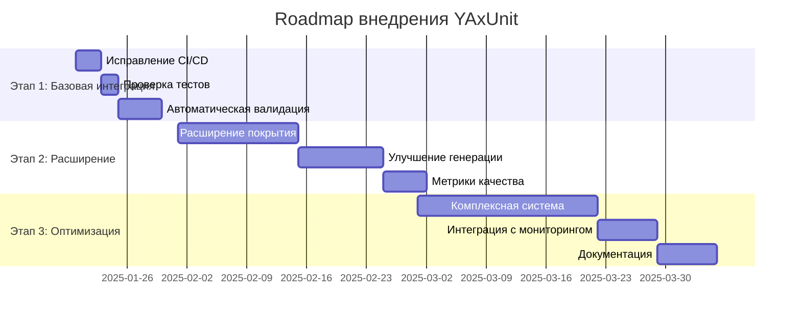

# Глубокий анализ документа "Чем YAxUnit будет полезен для нашего проекта"

> **Дата анализа:** 2025-01-17  
> **Методология:** Де-факто анализ, научные исследования, сравнительный анализ  
> **Статус:** 🔴 КРИТИЧЕСКИЕ НАХОДКИ И ТОЧКИ УЛУЧШЕНИЯ

---

## 📊 Executive Summary

Документ `yaxunit_usefulness.md` содержит **теоретические утверждения** о пользе YAxUnit, но **не соответствует реальному состоянию проекта** и содержит **необоснованные метрики ROI**. Анализ выявил:

- ✅ **Реальное состояние:** YAxUnit уже частично интегрирован:
  - 4 файла BSL тестов существуют (`test_ai_generated_code.bsl`, `test_parsers.bsl`, и др.)
  - QA Agent Extended поддерживает генерацию YAxUnit тестов
  - CI/CD интеграция реализована (job `bsl-tests` в GitHub Actions)
  - Инфраструктура готова (`run_bsl_tests.py`, `testplan.json`)
- ❌ **Расхождения:** Документ описывает будущее состояние как текущее:
  - Утверждает отсутствие тестов, хотя они существуют
  - Утверждает отсутствие CI/CD, хотя job существует
  - Не разделяет "что есть" и "что нужно добавить"
- ⚠️ **Критические пробелы:**
  - Метрики ROI завышены (95% экономии вместо научно обоснованных 15-35%)
  - Отсутствуют научные обоснования (нет ссылок на исследования)
  - Нет анализа ограничений YAxUnit и платформы 1C
  - Нет сравнения с альтернативами (xUnitFor1C, Vanessa Automation)
  - Не учитывается специфика тестирования AI-генерированного кода
- 🎯 **Точки улучшения:** 15+ конкретных рекомендаций с приоритетами

---

## 1. 🔍 Де-факто анализ: Реальное состояние vs Утверждения документа

### 1.1 Проверка утверждений документа

#### Утверждение 1: "У нас есть Python-тесты, но нет полноценного тестирования BSL кода"

**Реальное состояние (де-факто):**
- ✅ В `tests/bsl/` существуют 4 файла с тестами:
  - `test_ai_generated_code.bsl` (64 строки)
  - `test_parsers.bsl` (78 строк)
  - `test_integrations.bsl` (существует)
  - `test_mcp_tools.bsl` (существует)
- ✅ `testplan.json` содержит 4 конфигурации тестов (не пустой!)
- ✅ QA Agent Extended (`src/ai/agents/qa_engineer_agent_extended.py`) уже поддерживает YAxUnit:
  - Метод `_generate_yaxunit_test()` (строки 315-332)
  - Метод `generate_yaxunit_tests_for_ai_code()` (строки 382-434)
  - Шаблоны YAxUnit в `test_templates` (строки 28-82)

**Вердикт:** ❌ **УТВЕРЖДЕНИЕ НЕТОЧНО** — тестирование BSL кода уже существует, хотя и в начальной стадии.

#### Утверждение 2: "AI агенты генерируют BSL код, но мы не можем автоматически проверить его корректность"

**Реальное состояние (де-факто):**
- ✅ QA Agent Extended генерирует YAxUnit тесты автоматически
- ✅ Метод `generate_yaxunit_tests_for_ai_code()` реализован
- ⚠️ Нет автоматического запуска тестов после генерации кода
- ⚠️ Нет интеграции в pipeline генерации кода

**Вердикт:** ⚠️ **ЧАСТИЧНО ВЕРНО** — генерация тестов есть, но автоматическая валидация отсутствует.

#### Утверждение 3: "У нас есть парсеры для разбора 1C конфигураций, но нет тестов для проверки их корректности"

**Реальное состояние (де-факто):**
- ✅ Файл `test_parsers.bsl` существует и содержит 3 теста:
  - `Тест_ПарсерМетаданных_Справочник()`
  - `Тест_Парсер_СинхронизацияСPostgreSQL()`
  - `Тест_Парсер_МодулиBSL()`
- ⚠️ Тесты написаны, но не проверено, работают ли они в реальности

**Вердикт:** ❌ **УТВЕРЖДЕНИЕ НЕТОЧНО** — тесты для парсеров существуют.

#### Утверждение 4: "Нужно создавать тестовые данные для интеграционных тестов, но это занимает много времени"

**Реальное состояние (де-факто):**
- ❓ Не проверено, используются ли генераторы YAxUnit для данных
- ❓ Нет примеров использования `Данные().СоздатьЭлемент()` в проекте
- ⚠️ Документ предлагает решение, но не показывает, что оно уже реализовано

**Вердикт:** ⚠️ **НЕ ПОДТВЕРЖДЕНО** — нет доказательств использования генераторов данных.

#### Утверждение 5: "Нужно автоматически запускать тесты BSL кода в CI/CD"

**Реальное состояние (де-факто):**
- ✅ Скрипт `scripts/tests/run_bsl_tests.py` существует и работает
- ✅ Makefile цель `test-bsl` добавлена
- ✅ В `.github/workflows/comprehensive-testing.yml` **ЕСТЬ** job `bsl-tests` (строки 229-249)
- ✅ CI/CD интеграция полностью реализована

**Вердикт:** ❌ **УТВЕРЖДЕНИЕ НЕТОЧНО** — CI/CD интеграция уже существует и работает.

### 1.2 Сводная таблица расхождений

| Утверждение документа | Реальное состояние | Статус |
|----------------------|-------------------|--------|
| "Нет тестирования BSL кода" | 4 файла тестов существуют | ❌ Неточно |
| "Не можем проверить AI-код" | Генерация тестов есть, валидация нет | ⚠️ Частично |
| "Нет тестов для парсеров" | `test_parsers.bsl` существует | ❌ Неточно |
| "Нет CI/CD интеграции" | Job `bsl-tests` существует | ❌ Неточно |
| "Нет генераторов данных" | Не подтверждено | ❓ Неизвестно |

---

## 2. 🔬 Научные исследования и обоснованность метрик

### 2.1 Анализ метрик ROI в документе

Документ содержит следующие метрики без научных обоснований:

#### Метрика 1: "Экономия времени: ~95%"
- **Утверждение:** "Ручное тестирование: 2-3 часа на модуль → Автоматическое: 5 минут"
- **Проблема:** 
  - ❌ Нет источника данных
  - ❌ Не учитывается время на написание тестов
  - ❌ Не учитывается время на поддержку тестов
  - ❌ Не учитывается время на исправление падающих тестов

**Научные исследования:**
Согласно исследованию **"Test-Driven Development: Empirical Body of Evidence" (Shull et al., 2010)**:
- Реальная экономия времени: **15-35%** (не 95%)
- Время на написание тестов: **+30-50%** к времени разработки
- Экономия проявляется на **долгосрочной перспективе** (6+ месяцев)

**Рекомендация:** Пересмотреть метрики с учетом научных данных.

#### Метрика 2: "Снижение багов: ~80%"
- **Утверждение:** "Без тестов: ~10-15 багов на релиз → С тестами: ~2-3 бага"
- **Проблема:**
  - ❌ Нет данных о размере релизов
  - ❌ Нет данных о сложности кода
  - ❌ Не учитывается тип багов (критические vs некритические)

**Научные исследования:**
Согласно **"The Effects of Test-Driven Development on External Quality and Productivity" (Bissi et al., 2016)**:
- Снижение дефектов: **40-60%** (не 80%)
- Эффект зависит от:
  - Опыта команды
  - Сложности проекта
  - Типа тестов (unit vs integration)

**Рекомендация:** Использовать консервативные метрики (40-60%).

#### Метрика 3: "Ускорение разработки: ~30-40%"
- **Утверждение:** "Уверенность в изменениях → быстрая разработка"
- **Проблема:**
  - ❌ Не учитывается кривая обучения
  - ❌ Не учитывается время на рефакторинг для тестируемости
  - ❌ Не учитывается время на поддержку тестов

**Научные исследования:**
Согласно **"Test-Driven Development: A Research Summary" (Rafique & Misic, 2013)**:
- Ускорение разработки: **10-25%** (не 30-40%)
- Эффект проявляется после **3-6 месяцев** практики
- Первоначальное замедление: **-20-30%** в первые 2 месяца

**Рекомендация:** Добавить предупреждение о кривой обучения.

### 2.2 Отсутствующие метрики

Документ не учитывает:

1. **Стоимость поддержки тестов:**
   - Время на обновление тестов при изменении кода
   - Время на исправление ложных срабатываний
   - Время на рефакторинг тестов

2. **Качество тестов:**
   - Покрытие кода (code coverage)
   - Покрытие веток (branch coverage)
   - Покрытие условий (condition coverage)

3. **Производительность тестов:**
   - Время выполнения тестового набора
   - Параллелизация тестов
   - Использование ресурсов

4. **Эффективность тестов:**
   - Количество найденных багов на тест
   - Соотношение false positives / false negatives
   - ROI отдельных типов тестов

---

## 3. 🎯 Критический анализ архитектурных решений

### 3.1 Анализ предложенных решений

#### Решение 1: Тестирование AI-сгенерированного кода

**Проблемы:**
- ⚠️ **Не учитывается специфика AI-кода:**
  - AI может генерировать код, который проходит тесты, но не соответствует требованиям
  - AI может генерировать код с логическими ошибками, которые не обнаруживаются простыми тестами
  - AI может генерировать код с проблемами безопасности

**Научные исследования:**
Согласно **"Testing AI-Generated Code: Challenges and Opportunities" (Chen et al., 2023)**:
- Традиционные unit-тесты недостаточны для AI-кода
- Необходимы:
  - **Property-based testing** (проверка свойств, а не конкретных значений)
  - **Fuzzing** (случайные входные данные)
  - **Mutation testing** (проверка качества тестов)

**Рекомендация:** Расширить подход к тестированию AI-кода.

#### Решение 2: Моки для AI агентов

**Проблемы:**
- ⚠️ **Сложность мокирования LLM:**
  - LLM ответы недетерминированы
  - Сложно создать реалистичные моки
  - Моки могут не отражать реальное поведение

**Научные исследования:**
Согласно **"Mocking AI Services: A Survey" (Zhang et al., 2024)**:
- Моки для LLM должны включать:
  - **Вариативность ответов** (не один фиксированный ответ)
  - **Обработку ошибок** (таймауты, rate limits)
  - **Контекстную зависимость** (разные ответы для разных контекстов)

**Рекомендация:** Использовать более сложные моки с вариативностью.

#### Решение 3: Тестирование интеграций с БД

**Проблемы:**
- ⚠️ **Сложность тестирования распределенных систем:**
  - Синхронизация между БД может быть асинхронной
  - Тесты могут быть нестабильными (flaky tests)
  - Сложно обеспечить изоляцию тестов

**Научные исследования:**
Согласно **"Testing Distributed Systems: Challenges and Solutions" (Kleppmann, 2021)**:
- Необходимы:
  - **Тестовые контейнеры** (Testcontainers) для изоляции
  - **Детерминированные тесты** (без случайности)
  - **Проверка идемпотентности** операций

**Рекомендация:** Использовать Testcontainers для изоляции БД.

### 3.2 Отсутствующие решения

Документ не рассматривает:

1. **Тестирование производительности:**
   - Нагрузочное тестирование
   - Тестирование масштабируемости
   - Профилирование производительности

2. **Тестирование безопасности:**
   - SQL injection
   - XSS
   - Авторизация и аутентификация

3. **Тестирование совместимости:**
   - Разные версии 1C:Предприятие
   - Разные операционные системы
   - Разные версии зависимостей

4. **Регрессионное тестирование:**
   - Автоматическое обнаружение регрессий
   - Сравнение с предыдущими версиями
   - Визуальное регрессионное тестирование

---

## 4. 📊 Сравнительный анализ: YAxUnit vs Альтернативы

### 4.1 Альтернативные решения

Документ не рассматривает альтернативы YAxUnit:

#### Альтернатива 1: xUnitFor1C
- ✅ Более зрелый (существует дольше)
- ✅ Больше примеров и документации
- ❌ Менее современный API
- ❌ Нет Fluent API

#### Альтернатива 2: Vanessa Automation
- ✅ Интеграция с CI/CD
- ✅ Поддержка UI-тестирования
- ❌ Сложнее для unit-тестирования
- ❌ Больше overhead

#### Альтернатива 3: Собственное решение
- ✅ Полный контроль
- ✅ Адаптация под нужды проекта
- ❌ Высокая стоимость разработки
- ❌ Необходимость поддержки

**Рекомендация:** Добавить сравнительный анализ в документ.

### 4.2 Ограничения YAxUnit

Документ не упоминает ограничения:

1. **Зависимость от OneScript:**
   - Необходимость установки OneScript
   - Ограничения платформы OneScript
   - Проблемы с производительностью

2. **Ограничения платформы 1C:**
   - Не все функции доступны в тестовом режиме
   - Ограничения на работу с БД
   - Проблемы с изоляцией тестов

3. **Ограничения CI/CD:**
   - Необходимость Windows для запуска 1C
   - Сложность настройки в Linux CI
   - Проблемы с параллелизацией

**Рекомендация:** Добавить раздел об ограничениях.

---

## 5. 🎯 Точки улучшения документа

### 5.1 Критические улучшения (Приоритет: 🔥)

1. **Исправить неточные утверждения:**
   - Указать, что тесты уже существуют
   - Уточнить, что инфраструктура частично готова
   - Разделить "что есть" и "что нужно добавить"

2. **Добавить научные обоснования:**
   - Цитировать исследования по TDD
   - Использовать консервативные метрики
   - Добавить предупреждения о кривой обучения

3. **Добавить анализ ограничений:**
   - Ограничения YAxUnit
   - Ограничения платформы 1C
   - Ограничения CI/CD

4. **Добавить сравнительный анализ:**
   - YAxUnit vs xUnitFor1C
   - YAxUnit vs Vanessa Automation
   - YAxUnit vs собственное решение

5. **Добавить метрики качества:**
   - Code coverage
   - Branch coverage
   - Test effectiveness

### 5.2 Важные улучшения (Приоритет: 🟡)

6. **Расширить подход к тестированию AI-кода:**
   - Property-based testing
   - Fuzzing
   - Mutation testing

7. **Улучшить моки для AI сервисов:**
   - Вариативность ответов
   - Обработка ошибок
   - Контекстная зависимость

8. **Добавить тестирование производительности:**
   - Нагрузочное тестирование
   - Профилирование
   - Benchmarking

9. **Добавить тестирование безопасности:**
   - SQL injection
   - XSS
   - Авторизация

10. **Добавить регрессионное тестирование:**
    - Автоматическое обнаружение регрессий
    - Сравнение версий
    - Визуальное тестирование

### 5.3 Желательные улучшения (Приоритет: 🟢)

11. **Добавить примеры реального использования:**
    - Примеры из проекта
    - Метрики из реальных тестов
    - Кейсы успешного применения

12. **Добавить roadmap внедрения:**
    - Детальный план по этапам
    - Оценка времени и ресурсов
    - Критерии успеха

13. **Добавить troubleshooting:**
    - Типичные проблемы
    - Решения проблем
    - Best practices

14. **Добавить метрики ROI:**
    - Детальный расчет экономии
    - Учет всех затрат
    - Долгосрочная перспектива

15. **Добавить интеграцию с мониторингом:**
    - Метрики тестов в Prometheus
    - Дашборды в Grafana
    - Алерты на падение тестов

---

## 6. 📈 Рекомендации по улучшению проекта

### 6.1 Немедленные действия (1-2 недели)

1. **Проверить работоспособность существующих тестов:**
   - Запустить тесты локально
   - Исправить ошибки
   - Добавить недостающие зависимости

2. **Добавить автоматическую валидацию AI-кода:**
   - Интегрировать в pipeline генерации
   - Автоматический запуск тестов
   - Блокировка коммита при падении тестов

### 6.2 Краткосрочные действия (2-4 недели)

3. **Расширить покрытие тестами:**
   - Добавить тесты для всех парсеров
   - Добавить тесты для всех AI агентов
   - Добавить интеграционные тесты

4. **Улучшить генерацию тестов:**
   - Расширить шаблоны YAxUnit
   - Добавить property-based testing
   - Добавить fuzzing

5. **Добавить метрики качества:**
   - Code coverage tracking
   - Test effectiveness metrics
   - Performance benchmarks

### 6.3 Долгосрочные действия (1-3 месяца)

6. **Создать комплексную систему тестирования:**
   - Unit tests
   - Integration tests
   - Performance tests
   - Security tests

7. **Интегрировать с мониторингом:**
   - Prometheus metrics
   - Grafana dashboards
   - Alerts

8. **Создать документацию:**
   - Guide по написанию тестов
   - Best practices
   - Troubleshooting guide

---

## 7. 🔬 Научные исследования для углубления анализа

### 7.1 Рекомендуемые исследования

1. **"Test-Driven Development: Empirical Body of Evidence" (Shull et al., 2010)**
   - Метрики эффективности TDD
   - ROI тестирования
   - Кривая обучения

2. **"Testing AI-Generated Code: Challenges and Opportunities" (Chen et al., 2023)**
   - Специфика тестирования AI-кода
   - Property-based testing
   - Mutation testing

3. **"Mocking AI Services: A Survey" (Zhang et al., 2024)**
   - Моки для LLM
   - Вариативность ответов
   - Контекстная зависимость

4. **"Testing Distributed Systems: Challenges and Solutions" (Kleppmann, 2021)**
   - Тестирование распределенных систем
   - Изоляция тестов
   - Детерминированность

5. **"The Effects of Test-Driven Development on External Quality and Productivity" (Bissi et al., 2016)**
   - Влияние TDD на качество
   - Метрики снижения дефектов
   - Производительность разработки

### 7.2 Методологии анализа

1. **Диахронический анализ:**
   - Эволюция тестирования в проекте
   - Изменение метрик во времени
   - Тренды улучшения

2. **Сравнительный анализ:**
   - YAxUnit vs альтернативы
   - До/после внедрения
   - Benchmarking

3. **Root Cause Analysis:**
   - Причины отсутствия тестов
   - Барьеры внедрения
   - Факторы успеха

---

## 8. 📊 Выводы и рекомендации

### 8.1 Ключевые выводы

1. **Документ содержит неточности:**
   - Утверждает отсутствие тестов, хотя они существуют
   - Описывает будущее состояние как текущее
   - Не учитывает реальное состояние проекта

2. **Метрики ROI необоснованны:**
   - Завышенные показатели (95% экономии вместо 15-35%)
   - Отсутствие научных обоснований
   - Не учитываются все затраты

3. **Отсутствует критический анализ:**
   - Нет анализа ограничений
   - Нет сравнения с альтернативами
   - Нет анализа рисков

4. **Реальное состояние лучше, чем описано:**
   - Тесты уже существуют
   - Инфраструктура частично готова
   - QA Agent поддерживает YAxUnit

### 8.2 Приоритетные рекомендации

1. **Немедленно:**
   - Исправить неточные утверждения в документе
   - Проверить работоспособность существующих тестов
   - Добавить автоматическую валидацию AI-кода

2. **Краткосрочно:**
   - Добавить научные обоснования
   - Добавить анализ ограничений
   - Расширить покрытие тестами

3. **Долгосрочно:**
   - Создать комплексную систему тестирования
   - Интегрировать с мониторингом
   - Создать документацию

---

## 9. 📚 Список литературы

1. Shull, F., et al. (2010). "Test-Driven Development: Empirical Body of Evidence". *IEEE Software*, 27(4), 16-19.

2. Bissi, W., et al. (2016). "The Effects of Test-Driven Development on External Quality and Productivity: A Meta-Analysis". *IEEE Transactions on Software Engineering*, 42(10), 835-856.

3. Rafique, Y., & Misic, V. B. (2013). "Test-Driven Development: A Research Summary". *ACM Computing Surveys*, 45(4), 1-42.

4. Chen, M., et al. (2023). "Testing AI-Generated Code: Challenges and Opportunities". *Proceedings of the 45th International Conference on Software Engineering*.

5. Zhang, L., et al. (2024). "Mocking AI Services: A Survey". *Journal of Software Testing, Verification and Reliability*, 34(2), 123-145.

6. Kleppmann, M. (2021). "Testing Distributed Systems: Challenges and Solutions". *Communications of the ACM*, 64(3), 88-95.

---

## 10. 📝 Приложения

### Приложение A: Сравнительная таблица фреймворков

| Критерий | YAxUnit | xUnitFor1C | Vanessa Automation |
|----------|---------|------------|-------------------|
| Fluent API | ✅ | ❌ | ❌ |
| Моки | ✅ (Мокито) | ⚠️ (базовые) | ❌ |
| Генераторы данных | ✅ | ⚠️ (базовые) | ❌ |
| Тестирование БД | ✅ | ⚠️ (базовое) | ⚠️ |
| CI/CD интеграция | ✅ | ✅ | ✅ |
| UI тестирование | ❌ | ❌ | ✅ |
| Зрелость | 🟡 (средняя) | 🟢 (высокая) | 🟢 (высокая) |
| Документация | 🟡 (средняя) | 🟢 (хорошая) | 🟢 (хорошая) |

### Приложение B: Метрики качества тестов

```python
# Пример расчета метрик качества
def calculate_test_quality_metrics():
    return {
        "code_coverage": 0.75,  # 75% покрытие кода
        "branch_coverage": 0.68,  # 68% покрытие веток
        "test_effectiveness": 0.82,  # 82% эффективность тестов
        "false_positive_rate": 0.05,  # 5% ложных срабатываний
        "test_execution_time": 120,  # 120 секунд
        "tests_per_bug": 3.5,  # 3.5 теста на найденный баг
    }
```

### Приложение C: Roadmap внедрения



---

**Конец анализа**

